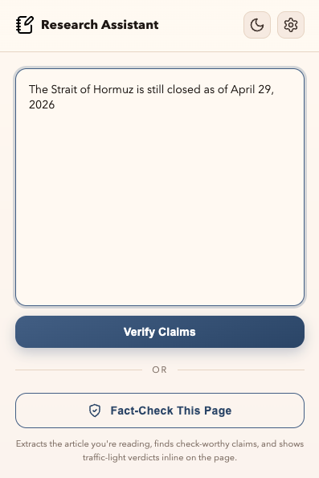
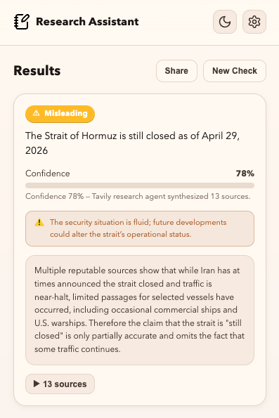
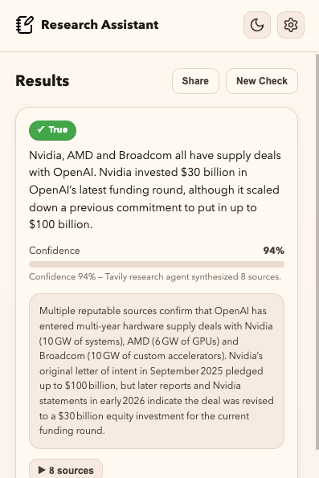

# Tavily Research Assistant


The most successful tools are the ones that feel effortless. There’s no better place to do research than directly in your browser, one click away.

> **Note:** This extension was built as a way to explore 
> the Tavily `/research` endpoint, how submissions, polling,
> structured outputs, and source citations work end to end.
> Project also uses `/extract` to obtain relevant content from the page first.


<p align="center">
  
  
  
</p>

 **Project Idea:**
Lightweight Chrome Extension that runs Tavily's `/research` endpoint on any text you paste or
select on a webpage, then renders the resulting verdict, summary, and cited
sources in a popup. Also performs article fact checking with inline annotations.

## How To Use:

1. You paste text into the popup, or right-click → **Search Selection**, or hit
   `Ctrl+Shift+F` (`Cmd+Shift+F` on macOS) with text highlighted.
2. The background service worker submits that text verbatim to Tavily's
   `/research` endpoint and polls until the research task completes.
3. Tavily runs multi-source web search, weighs the evidence, and returns a
   structured verdict — label, confidence, summary, explanation, and a list of
   cited sources.
4. The popup renders the verdict with citations and a copy-to-clipboard share
   button. Live status updates and an elapsed-time counter run while the
   research is in flight.

## Features

- **Paste, select, or shortcut entry** — three ways to send text in
- **Live progress** — stage label, indeterminate progress bar, ticking elapsed
  timer, and streaming status messages from the background worker
- **Tavily research models** — pick `mini`, `auto`, or `pro` per your latency
  vs. depth tradeoff
- **Citation formats** — numbered, MLA, APA, or Chicago, selected in settings
- **Verdict caching** — repeated checks of the same claim return cached results
  immediately; cached entries are keyed by claim text
- **Rate limiting** — 10 requests/minute guardrail to protect API quota
- **Local-only key storage** — your Tavily API key lives in
  `chrome.storage.local`, never leaves the browser
- **Light/dark theme** — warm cream-and-peach light theme, deep navy dark
  theme; toggleable in the header and persisted to `localStorage`
- **Share** — one-click copy of a plain-text summary of the result

## Verdict labels

| Verdict                   | Meaning                                 | Color     |
| ------------------------- | --------------------------------------- | --------- |
| **SUPPORTED**             | Strong evidence confirms the claim      | 🟢 Green  |
| **FALSE**                 | Strong evidence contradicts the claim   | 🔴 Red    |
| **MISLEADING**            | Contains truth but deceptive overall    | 🟠 Orange |
| **INSUFFICIENT_EVIDENCE** | Not enough reliable sources to conclude | ⚪ Gray   |

Tavily returns the verdict label, a 0–1 confidence score, a one-sentence
summary, a longer explanation, and a markdown report containing inline
citations.

## How It Works

The extension uses a multi-stage pipeline to verify information, leveraging LLMs for identification and Tavily for deep web research.

### Step 1: Content Extraction (`/extract`)
When you click **"Fact-Check This Page"**, the extension sends the current URL to Tavily's `/extract` endpoint. This allows the system to:
*   Bypass the complex DOM of the local page and work with a clean, Markdown-formatted version of the article.
*   Strip away "noise" like navigation bars, advertisements, and footers that can confuse AI models.
*   Ensure the fact-checking logic is focused only on the core substance of the article.

### Step 2: Claim Identification (LLM)
The "cleaned" text is sent to your selected LLM provider (Claude or GPT-4o-mini). The model acts as a "Gatekeeper" to find **check-worthy claims**. 
*   It looks for specific, verifiable facts (numbers, dates, names).
*   It ignores opinions, analysis, and trivial truths.
*   It transforms vague sentences into **self-contained research queries** so they can be verified independently of the original context.

### Step 3: Deep Research (`/research`)
Each identified claim is sent to Tavily’s `/research` endpoint. This is the "Truth Engine" of the extension:
*   **Multi-Source Search:** The research agent performs multiple targeted web searches across reputable sources (news wire services, academic databases, and government reports).
*   **Information Synthesis:** It cross-references these sources to find points of agreement or contradiction.
*   **Structured Verdict:** Instead of just returning search results, it returns a structured JSON object containing a definitive verdict, a calibrated confidence score (0-100%), a detailed explanation, and a full Markdown report with inline citations.

---

## Architecture

```
extension/
├── src/
│   ├── background/
│   │   └── index.ts        # Service worker: routes messages, owns research call
│   ├── content/
│   │   └── contentScript.ts # Reads selected text from the active tab
│   ├── lib/
│   │   ├── tavily.ts       # /research submit + poll + structured-output parser
│   │   ├── verdictEngine.ts# Verdict label → color/icon helpers
│   │   └── types.ts        # Shared TS types
│   ├── ui/
│   │   ├── App.tsx         # Popup root, state machine
│   │   ├── components/     # Header, ClaimCard, VerdictBadge, CitationList,
│   │   │                   # ApiKeyInput
│   │   ├── icons.tsx       # SVG icon set
│   │   └── styles.css      # Theme tokens + component CSS
│   └── utils/
│       ├── messaging.ts    # chrome.runtime helpers + storage wrapper
│       ├── cache.ts        # Verdict cache in chrome.storage
│       └── rateLimiter.ts  # In-memory token bucket
├── public/
│   ├── manifest.json
│   └── icons/
└── dist/                   # Build output (loaded as unpacked extension)
```

## Getting started

### Prerequisites

- Node.js 18+
- A Tavily API key — [tavily.com](https://tavily.com)

### Install

```bash
git clone https://github.com/RobertTylman/Live-Fact-Checking-Assistant.git
cd Live-Fact-Checking-Assistant/extension
npm install
npm run build
```

### Load in Chrome

1. Open `chrome://extensions/`
2. Enable **Developer mode**
3. Click **Load unpacked** and select the `extension/dist` folder

### Configure

1. Click the extension icon (or press `Cmd+Shift+F` / `Ctrl+Shift+F`)
2. Open settings (gear icon, top right)
3. Paste your Tavily API key and save
4. Pick a research model and citation format

The popup is now ready. Type or paste text and hit **Search**, or highlight
text on any page and use the keyboard shortcut or context menu.

## Development

```bash
npm run dev         # vite build --watch
npm run typecheck   # tsc --noEmit
npm run lint        # eslint
npm run format      # prettier --write
npm run test        # vitest run
npm run build       # typecheck + vite build + postbuild copy
```

## Security

- The Tavily API key is read and used only by the background service worker —
  it is never exposed to page context or content scripts.
- Both the API key and the research-settings preferences are stored in
  `chrome.storage.local` on the user's machine.
- Rate limiting (10 requests/minute) is enforced before any outbound call.
- No analytics, no telemetry, no third-party trackers.

## License

MIT

## Acknowledgments

- [Tavily](https://tavily.com) for the research API
- Built with React, TypeScript, and Vite
